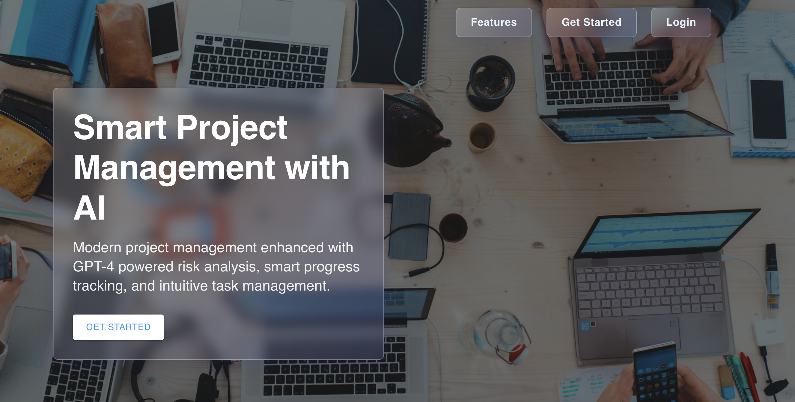
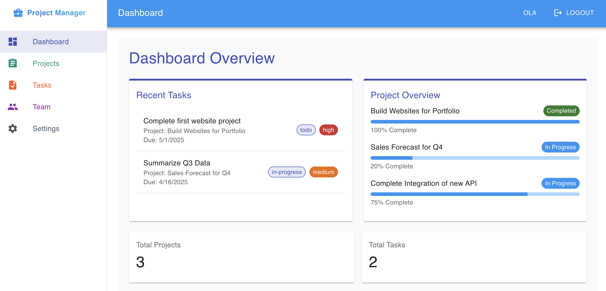
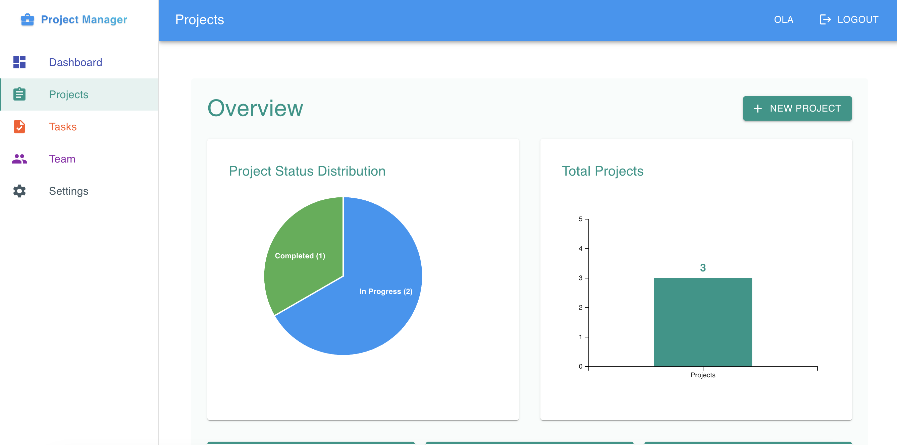
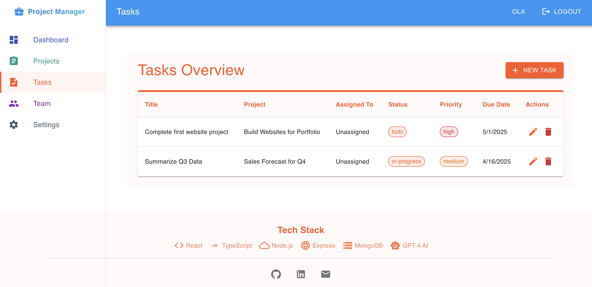
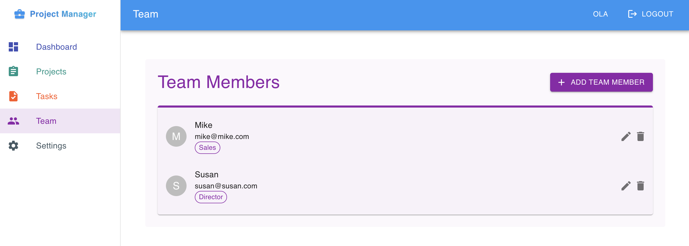
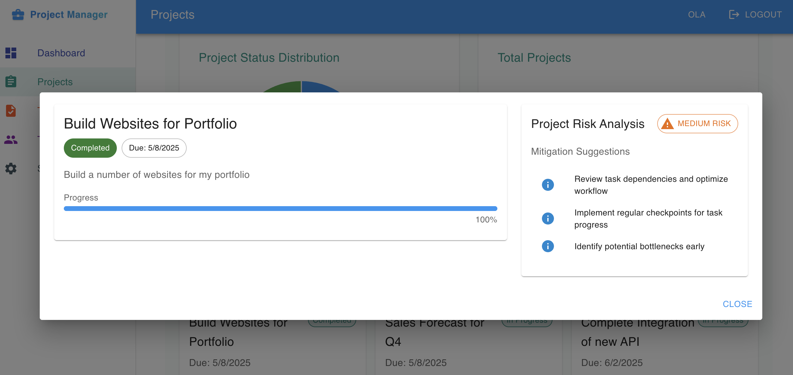
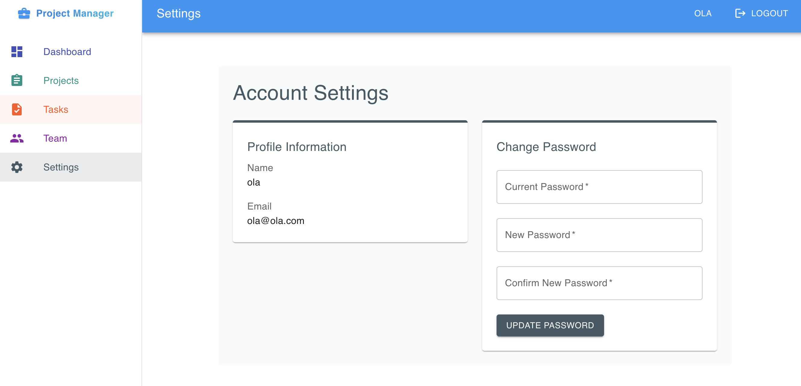

# Project Management Tool

A full-stack project management application built with the MERN stack (MongoDB, Express.js, React, Node.js).

🚀 [Live Demo](https://project-management-tool-app-d826a567f678.herokuapp.com/)

## Screenshots

### Homepage


### Dashboard


### Projects Overview


### Task Management


### Team Management


### Risk Analysis


### Settings


## Features

- Modern Project Management
  - Create, update, and delete projects with an intuitive interface
  - Track project progress with visual progress bars
  - Set and manage project deadlines
  - Organize projects with detailed descriptions and status updates
  - Modern, responsive UI with Material Design

- Task Management
  - Add and manage tasks within projects
  - Track task completion status
  - Organize tasks with descriptions
  - Batch task management capabilities
  - Task status tracking (Not Started, In Progress, Completed)

- AI-Powered Risk Analysis
  - Automated project risk assessment using GPT-4
  - Real-time risk level determination (High, Medium, Low)
  - Detailed risk factor analysis
  - AI-generated mitigation strategies
  - Contextual risk insights based on project details

- Project Analytics & Insights
  - Visual project progress tracking
  - Project overview dashboard
  - Status distribution analytics
  - Progress tracking visualization
  - Real-time project statistics

- User Experience
  - Clean and intuitive interface
  - Responsive design for all devices
  - Real-time updates and feedback
  - Smooth animations and transitions
  - Accessible design patterns

## Tech Stack

### Frontend
- React 18 with TypeScript
- Redux Toolkit for state management
- Material-UI v5 for components
- Chart.js for analytics
- Modern responsive design
- Progressive Web App capabilities

### Backend
- Node.js with Express
- MongoDB with Mongoose ODM
- RESTful API architecture
- GPT-4 AI integration


### DevOps & Tools
- MongoDB Atlas for database hosting
- GitHub for version control
- ESLint & Prettier for code quality
- TypeScript for type safety


## Getting Started

1. Clone the repository
2. Set up environment variables (see `.env.example` files)
3. Install dependencies for both client and server
4. Run development servers

Detailed setup instructions coming soon...

## Project Structure

```
project-management-tool/
├── client/               # React frontend
│   ├── src/
│   │   ├── components/  # Reusable components
│   │   ├── pages/      # Page components
│   │   ├── store/      # Redux store
│   │   ├── hooks/      # Custom hooks
│   │   └── utils/      # Utility functions
│   └── public/         # Static files
│
├── server/              # Node.js backend
│   ├── src/
│   │   ├── controllers/# Route controllers
│   │   ├── models/     # Mongoose models
│   │   ├── routes/     # API routes
│   │   ├── middleware/ # Custom middleware
│   │   └── utils/      # Utility functions
│   └── uploads/        # File uploads
│
└── README.md           # Project documentation
```

## Contributing

This project is part of a portfolio and is not open for contributions at this time.

## License

MIT License - feel free to use this code for learning purposes.